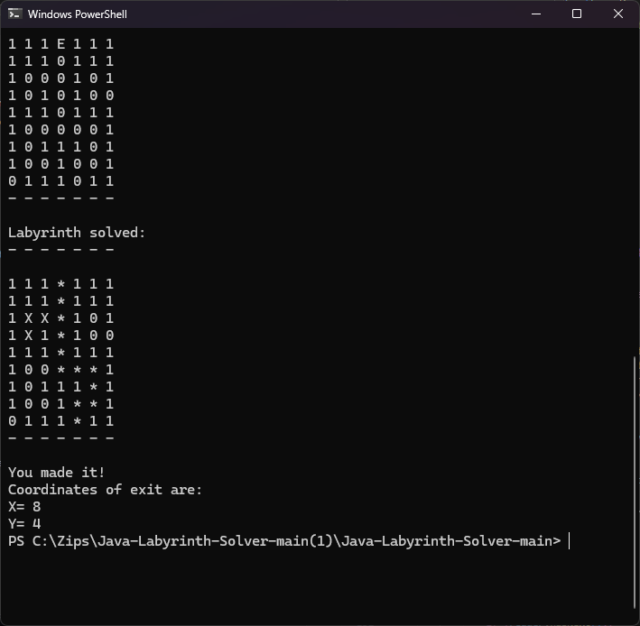
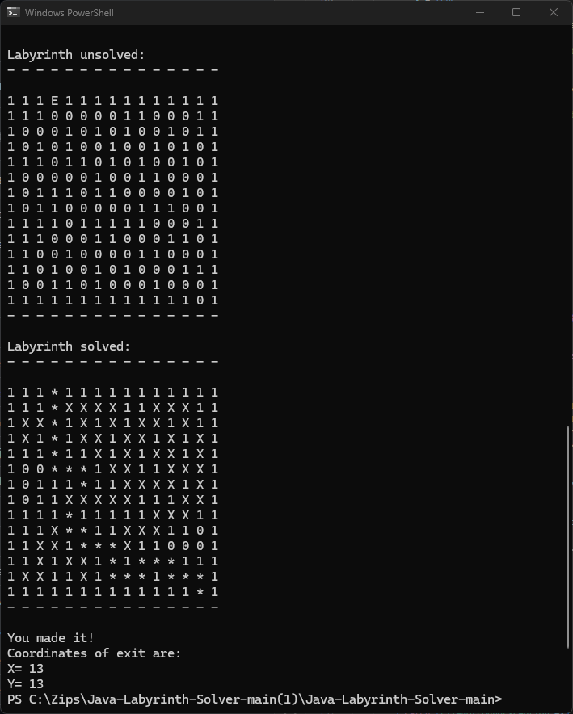

# Thiseas

A Labyrinth-Solver program made in java, suing custom made stack and queue data structures 


## Installation

    1. Download the project directories
    2. Compile all .java files
    3. Run Thiseas.java using one of the input.txt files 

```bash
  Thiseas input.txt
```
    


